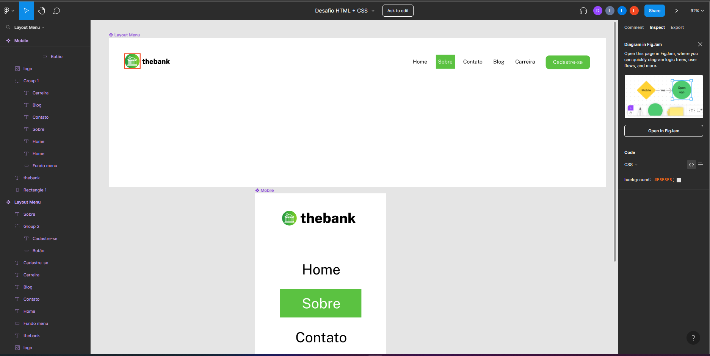
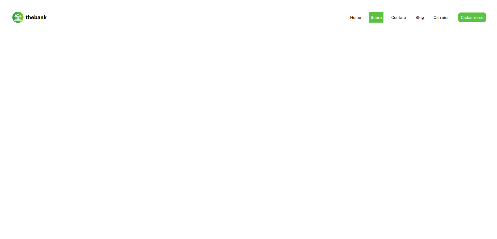
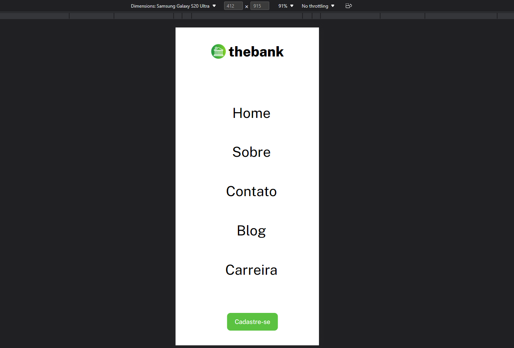

# Desafio HTML e CSS menu com flex box #

Esse exercicio tinha com desafio, criar um layout de um menu responsivo como o exemplo no figma.

### Imagem do menu no figma ###

### Design desktop ###

### Design mobile ###

## Tecnologias usadas
- HTML
- CSS